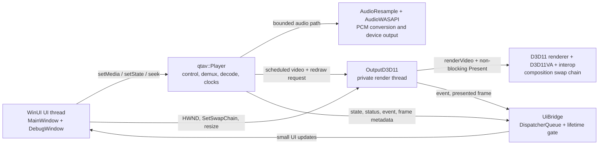

# WinUI 3 player architecture

## Scope

The WinUI 3 player is an integration example around QtAVCore's public Windows
targets. It owns application windows and translates UI actions into Player
operations. It deliberately delegates media I/O, decoding, buffering,
synchronization, audio output, video rendering, presentation, and hardware
fallback to the library.

The example has four goals:

1. keep the WinUI dispatcher independent from playback timing;
2. exercise the production Windows audio/video stack through public APIs;
3. make local-file and file-style URL behavior observable;
4. shut down every callback and worker with deterministic ownership.

It is not a reusable WinUI control, a playlist engine, or an adaptive streaming
client.

## Component map



## Major classes

| Class | Role | Ownership |
| --- | --- | --- |
| `App` | Creates and activates the main window; reports startup exceptions. | Owns the WinUI `MainWindow` reference. |
| `MainWindow` | XAML event surface and public window lifetime. | Owns `MainWindowPrivate`. |
| `MainWindowPrivate` | Wires controls, Player, video output, timers, seeking, and diagnostics. | Owns Player before attaching output; explicitly releases output before Player. |
| `UiBridge` | Posts worker notifications to `DispatcherQueue` and gates callbacks during teardown. | Shared by callbacks; holds only an atomic, non-owning target. |
| `CallbackState` | Holds lock-free cadence counters and one-shot log flags. | Shared by callbacks independently of the window lifetime. |
| `DebugWindow` | Displays the bounded in-memory log. | Referenced by `MainWindowPrivate`; never used from playback workers. |
| `qtav::Player` | Asynchronous control, FFmpeg media work, decode queues, playback clock, and frame scheduling. | Uniquely owned by `MainWindowPrivate`. |
| `qtav::D3D11VideoOutput` | D3D11 device, swap chain, HDR/display state, renderer, hardware decode/interop integration, render thread, and presentation. | Uniquely owned by `MainWindowPrivate`; temporarily borrows Player while attached. |

## Thread model

The application assumes callbacks can arrive on non-UI threads even when the
current implementation commonly uses a particular worker. This keeps the UI
correct if callback routing changes later.

| Execution context | Work performed | Must not do |
| --- | --- | --- |
| WinUI dispatcher | XAML access, file picker, user commands, 250 ms progress sampling, debounced seek, surface binding/resize, Debug text updates. | Decode, block on network reads, submit audio, render frames, or call `Present()`. |
| Player control/demux worker | Opens media, reads packets, applies state/control requests, interrupts obsolete I/O, and emits control/status events. | Access XAML or depend on UI progress ticks. |
| Player audio decode worker | Decodes audio packets and feeds the bounded audio queue. | Wait for the UI or render thread. |
| Player audio-output worker | Converts negotiated PCM, writes the WASAPI sink, and samples/publishes the device clock. | Perform UI/log formatting or wait for video presentation. |
| Player video decode worker | Decodes video packets and feeds the bounded presentation path. | Present directly to the SwapChainPanel. |
| Player presentation worker | Applies playback timing, drops late video, publishes frame callbacks, and requests rendering. | Submit device audio or synchronously invoke the UI. |
| D3D11 output render thread | Coalesces redraws, calls `Player::renderVideoDetailed()`, retries classified transient contention, performs hardware interop or software fallback, tracks display color, and presents. | Access XAML controls or destroy/detach itself from its callback. |

All UI-bound notifications use this pattern:

1. a worker callback copies primitive values or owned strings;
2. it calls `UiBridge::post()`;
3. the dispatcher lambda atomically checks that the target is still alive;
4. only then does it update XAML or the Debug buffer.

Per-frame callbacks only update atomic counters. First-frame callbacks capture
a small metadata snapshot once. This prevents an open Debug window or a busy
dispatcher from applying backpressure to audio or video delivery.

## Playback flow

### Startup and media replacement

1. `MainWindowPrivate` creates Player and installs
   `SwresampleAudioConverter` plus `WasapiAudioSink`.
2. It registers callbacks, starts UI timers, and observes panel/slider events.
3. When `SwapChainPanel` is loaded, it creates `D3D11VideoOutput`, supplies the
   HWND and `SetSwapChain` callback, opens it, and attaches Player.
4. Opening a file or URL resets only UI/diagnostic generation state, calls
   `Player::setMedia()`, then requests `State::Playing`.
5. Player asynchronously interrupts any obsolete media operation, opens the
   new input, selects streams, configures decode, and starts delivery.

`D3D11VideoOutput::attach()` exclusively owns Player's default render API and
render callback while attached. By default it also configures D3D11VA using
the same D3D11 device required by the renderer and interop path.

### Audio path and master clock

```text
FFmpeg packet -> audio decode worker -> bounded audio queue
              -> audio-output worker -> libswresample -> WASAPI
              -> cached device presentation clock -> Player position/A-V timing
```

Audio submission is independent of the UI and video render threads. A valid
WASAPI presentation clock becomes playback master; `Player::position()` reads
a cached snapshot and does not query the device from the UI thread. During
underrun or a seek generation change, Player freezes or re-anchors the clock
rather than allowing an arbitrary UI timer to advance playback.

### Video path

```text
FFmpeg packet -> video decode worker -> bounded presentation queue
              -> presentation worker -> current frame + render request
              -> D3D11 output latest-frame mailbox
              -> render thread -> Player::renderVideoDetailed()
              -> D3D11VA interop or software fallback -> swap-chain Present
```

The presentation queue is bounded and late frames may be dropped. Render
requests are coalesced. A retryable Player/backend result remains in a
latest-frame mailbox; a newer sequence supersedes it instead of growing a
queue. Before each output pass makes its first non-blocking D3D11 context
attempt, it reserves the render thread ahead of new FFmpeg-side acquisitions.
An uncontended attempt proceeds immediately; contention enters an at-most-8-ms
handoff and uses bounded timer backoff only after a timeout. This wait, the
frame-latency cap, and non-blocking presentation all live on the private output
thread, so neither context contention nor a busy compositor stalls WASAPI or
the WinUI dispatcher.

Hardware frames normally remain on the selected D3D11 device. Their raw
NV12/P010 planes pass through libplacebo color processing and rendering
without a CPU map. Each raw decoder slice is copied once on the GPU into a
bounded ordinary NV12/P010 shader-resource ring before libplacebo sampling.
Submitted decoder slices, selected ring entries, and swap-chain back buffers
stay retained until GPU completion; output resize drains those submissions
before replacing the buffers. Every successfully imported D3D11VA frame uses
fast libplacebo parameters and remains in the bounded completion-query queue
until its resources can be recycled, regardless of adapter vendor. Software
frames remain outside this imported-frame policy. Unsupported media or devices
fall back through QtAVCore's software decode/render path rather than an
application-side decoder.

### Seek and progress

The progress timer samples cached `Player::position()` every 250 ms. It stops
changing the slider while the user is scrubbing or while a seek completion is
pending.

Pointer dragging submits one seek on release. Other slider value changes are
debounced for 180 ms. Each submitted seek receives a serial number; completion
from an older seek or media generation is ignored. Player performs the actual
seek asynchronously and uses `Buffering` while the new generation is waiting
for valid output.

## Output color policy

The example uses `PreferHdr` but explicitly selects an opaque RGB10/PQ
composition layer. It follows the window's current monitor and
checks Windows Advanced Color state, SDR reference white, and display peak
luminance per frame. HDR source is preserved on an active HDR display and tone
mapped to SDR when Advanced Color is inactive. The Debug window reports the
actual output state; the source metadata alone is not treated as proof that
Windows is presenting an HDR layer.

## Diagnostics

The in-memory log is capped at 1,000 lines. Opening the Debug window displays
the existing history; closing it does not disable lightweight counter
collection.

Every five seconds during activity, the UI exchanges the atomic frame counters
and calls `D3D11VideoOutput::takeStatistics()`, which atomically returns and
resets output counters. Important interpretations are:

- low scheduled-video cadence usually points before the renderer: input,
  decode, clock, or Player presentation scheduling;
- normal scheduled cadence with low rendered cadence points at render
  contention, surface state, or the graphics driver;
- `capacity-wait(timeout)` reports waits on the swap chain's frame-latency
  handle and how many exhausted the bounded wait; `max-capacity-wait-ms`
  reports the longest wait. A timeout is diagnostic only: the render pass
  continues and non-blocking `Present()` makes the final capacity decision;
- `present-busy` means non-blocking `Present()` itself returned
  `DXGI_ERROR_WAS_STILL_DRAWING`;
- `decoder-copies` counts same-format decoder-to-shader GPU copies for raw
  NV12/P010 hardware frames; it remains zero for software frames;
- `coalesced` means multiple redraw notifications were intentionally combined;
- `no-frame/player-busy/renderer-busy` classifies unsuccessful attempts, while
  `renderer-busy(state/serialize/context/in-flight)` locates backend
  contention;
- `context-owner(reservation-aware/unreserved)` identifies an acquisition that
  still reached the renderer as busy after the proactive handoff, separating
  FFmpeg/internal owners from ordinary public owners;
- `handoff(wait/timeout)` records contention caught before the renderer and
  whether its bounded exchange succeeded, and
  `retry/superseded/terminal` distinguishes recovered attempts from frames that
  were actually lost;
- `render-skipped` is retained for compatibility and mirrors terminal drops;
- maximum color/interop/buffer/draw times identify the expensive D3D11 stage.

The format is intentionally human-readable and may change with diagnostics.

## Error handling

- Empty inputs are rejected on the UI thread.
- File-picker errors are shown in the status overlay and Debug log.
- Player open/decode/network failures arrive as media events and status
  transitions.
- Output failures are classified as a lost surface or general render error.
- A failed video-output initialization leaves playback unopened rather than
  silently playing audio with an unbound surface.
- HTTP(S) input uses bounded FFmpeg read-timeout and reconnect defaults.

## Shutdown sequence

Closing the main window invokes an idempotent ordered shutdown:

1. set `shuttingDown_` and clear `UiBridge::target` so queued callbacks become
   no-ops;
2. stop progress and seek timers;
3. close the Debug window;
4. request `State::Stopped`, which also makes active media I/O obsolete;
5. detach and close `D3D11VideoOutput`, stopping its render thread and releasing
   its Player render slot before either borrowed object disappears;
6. destroy Player, which signals its condition variables, interrupts FFmpeg
   I/O, joins control/demux, audio decode/output, video decode, and presentation
   workers, then closes the audio sink and media resources.

Teardown is synchronous by design. It may expose latency in an unresponsive
protocol or driver, but no worker is detached and no Player/output object is
allowed to outlive its dependencies. See
[ADR-005](ARCHITECTURE_DECISIONS.md#adr-005-deterministic-ordered-shutdown).

## Change boundaries

Changes that belong in this example include WinUI controls, surface-host
integration, UI marshalling, and presentation of diagnostics. General clock,
queue, codec, network-recovery, audio, rendering, hardware-interop, or shutdown
bugs belong in QtAVCore. If an integration change alters a decision here,
update `ARCHITECTURE_DECISIONS.md` in the same change.
